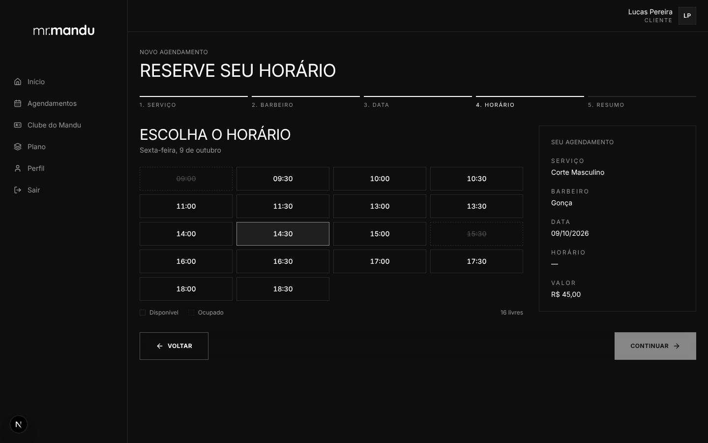
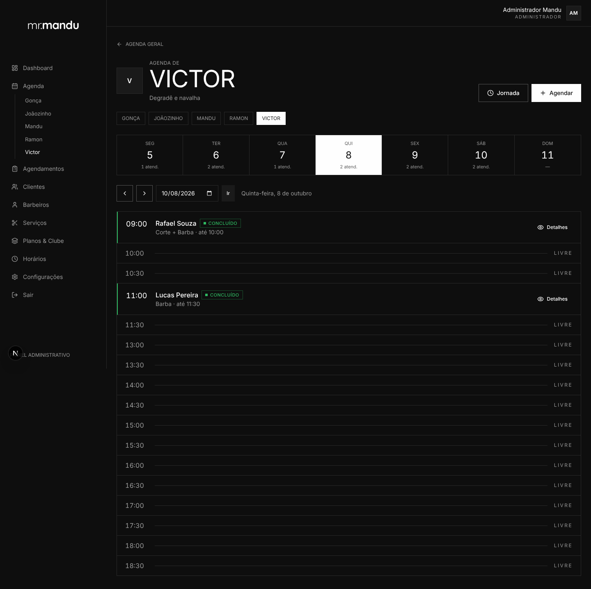
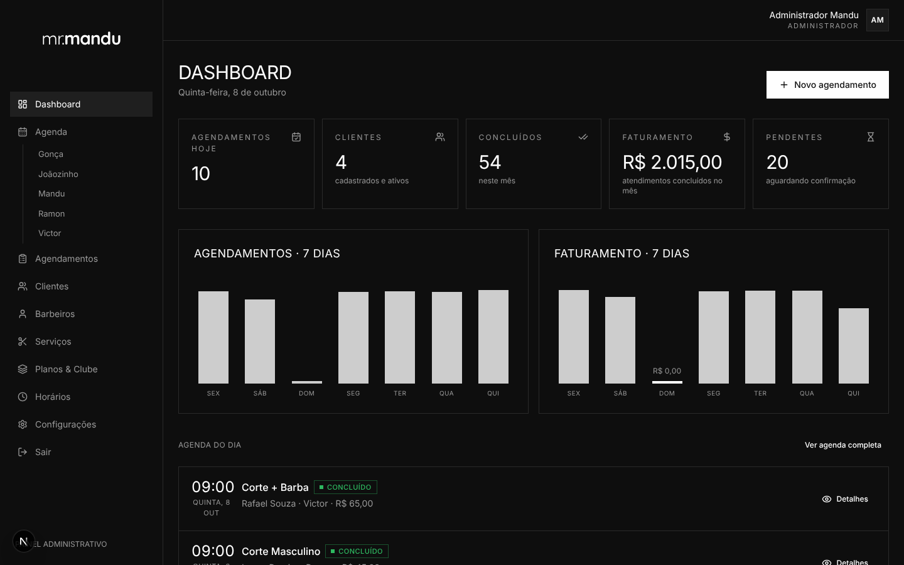
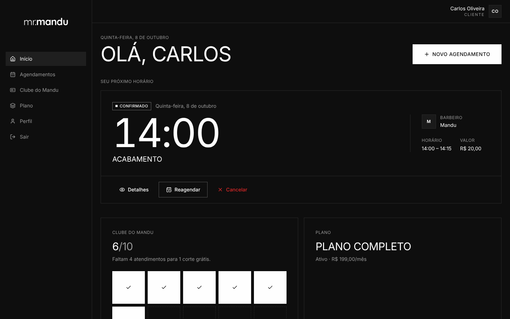
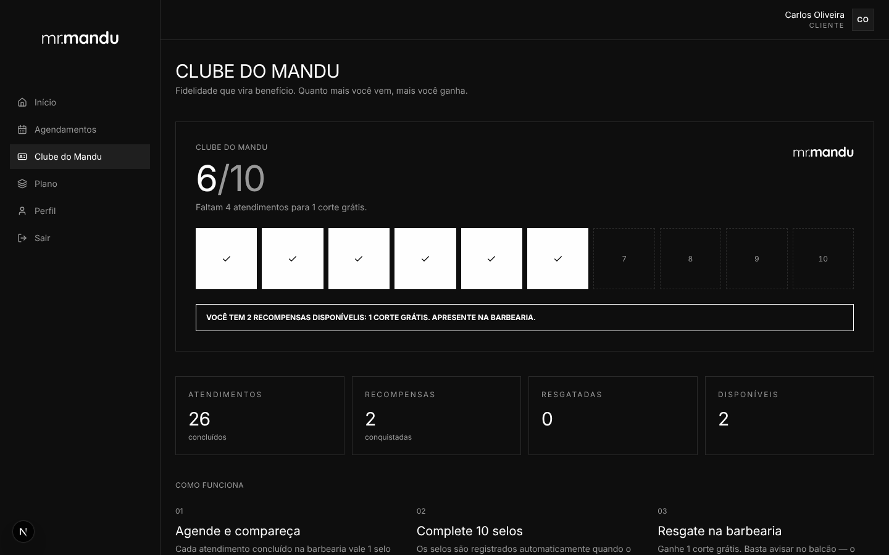
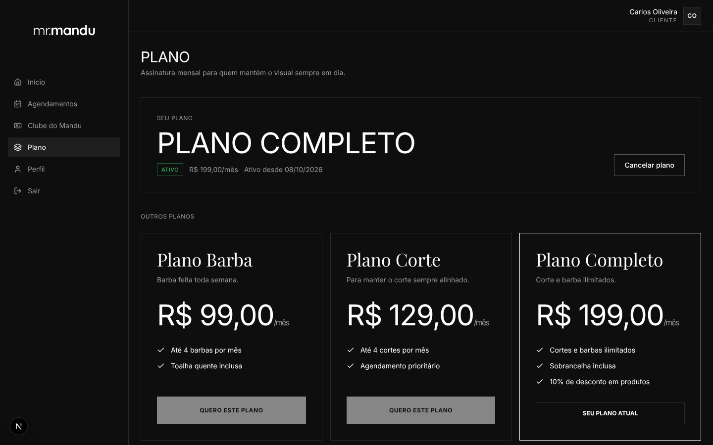
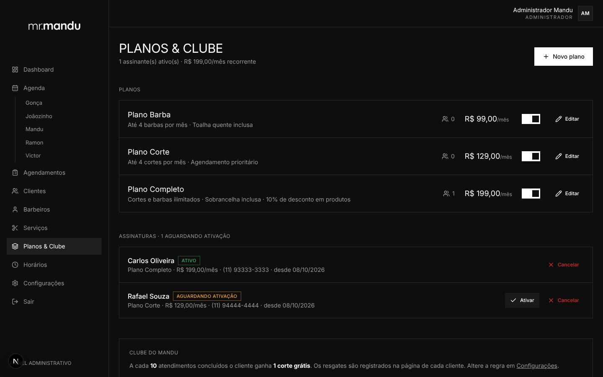

# mr.mandu — MR.MANDU BARBERS

Plataforma de agendamento para barbearia, com três perfis de acesso (**Cliente**, **Barbeiro** e **Administrador**), agenda com controle real de disponibilidade, Clube de fidelidade e Planos mensais.

> Não é um mockup: frontend, backend, banco de dados, autenticação, autorização e regras de agenda são funcionais e cobertos por testes de integração contra PostgreSQL.


> 🎬 **Apresentação do projeto:** https://theuzxl13-oss.github.io/mrmandu/
>
> 🕹️ **Demonstração interativa (navegue e teste):** https://theuzxl13-oss.github.io/mrmandu/demo/ — roda inteira no navegador, com dados fictícios salvos só no seu aparelho (código em `docs/demo/`, independente do sistema real).

[](https://codespaces.new/theuzxl13-oss/mrmandu?ref=claude/nifty-cerf-87tt09)

> 🧪 **Ver o sistema funcionando e editar pelo navegador:** clique no botão acima. Veja [Rodar no GitHub Codespaces](#rodar-no-github-codespaces).

## Visão geral (apresentação)

**O problema:** agenda em papel/WhatsApp gera conflito de horário, falta de controle e cliente esperando resposta.
**A solução:** o cliente agenda sozinho, 24h, escolhendo **serviço, barbeiro, dia e horário** — e o sistema garante que **nunca** haverá dois clientes no mesmo horário com o mesmo barbeiro.

| | |
|---|---|
| **Cliente escolhe o barbeiro** (Victor, Mandu, Joãozinho, Gonça, Ramon) ou "qualquer disponível" | **Só aparecem horários livres** — ocupados ficam riscados |
|  |  |
| **Agenda de cada barbeiro** — semana + linha do tempo do dia | **Dashboard do dono** — agendamentos, clientes, faturamento |
|  |  |
| **Área do cliente** — próximo horário, Clube e Plano | **Clube do Mandu** — fidelidade com selos |
|  |  |
| **Planos mensais** — receita recorrente | **Gestão de planos e assinaturas** |
|  |  |

<p align="center"><br/><em>100% responsivo — pensado primeiro para o celular.</em></p>

**Por que isso importa para o negócio**
- **Menos tempo no WhatsApp**: o cliente agenda, cancela e reagenda sozinho, dentro das regras da casa (antecedência, prazo de cancelamento).
- **Zero conflito de horário**: regra garantida no banco de dados, mesmo com dois clientes clicando ao mesmo tempo.
- **Cada barbeiro com sua agenda**: cada um entra com seu login e vê só os próprios atendimentos; o dono vê tudo.
- **Fidelização e receita recorrente**: Clube do Mandu (a cada 10 cortes, 1 grátis) e Planos mensais.
- **Números na mão**: faturamento do mês, atendimentos, pendências e gráfico dos últimos 7 dias.

---

## Sumário

- [Funcionalidades](#funcionalidades)
- [Tecnologias](#tecnologias)
- [Requisitos](#requisitos)
- [Rodar no GitHub Codespaces](#rodar-no-github-codespaces)
- [Instalação e execução](#instalação-e-execução)
- [Variáveis de ambiente](#variáveis-de-ambiente)
- [Banco de dados, migrações e seed](#banco-de-dados-migrações-e-seed)
- [Testes](#testes)
- [Usuários de teste](#usuários-de-teste)
- [Estrutura do projeto](#estrutura-do-projeto)
- [Arquitetura e decisões técnicas](#arquitetura-e-decisões-técnicas)
- [Segurança](#segurança)
- [Identidade visual](#identidade-visual)
- [Próximos passos sugeridos](#próximos-passos-sugeridos)

---

## Funcionalidades

**Site público**: home premium com serviços e barbeiros vindos do banco, sobre, benefícios, localização (mapa), horário de funcionamento e contato.

**Cliente** (`/cliente`)
- Cadastro, login, "esqueci minha senha" (link com token de uso único) e edição de dados/senha.
- **Início**: próximo horário (serviço, barbeiro, data, horário, valor, status) com *Detalhes / Cancelar / Reagendar*, resumo do Clube e do Plano.
- **Agendamentos**: abas *Próximos / Concluídos / Cancelados*.
- **Novo agendamento** em 5 etapas: serviço → barbeiro (ou *qualquer barbeiro disponível*) → data (calendário) → horário (ocupados riscados e não selecionáveis) → resumo e confirmação.
- **Clube do Mandu**: cartão de selos de fidelidade.
- **Plano**: planos mensais, solicitação e cancelamento.

**Barbeiro** (`/barbeiro`)
- Dashboard do dia (agendamentos de hoje, próximo atendimento, pendentes, total concluído).
- Agenda em linha do tempo (`08:00 — Livre`, `08:30 — João · Corte`…), navegação por data.
- Confirmar, cancelar, reagendar, concluir e anotar observações — **somente nos próprios atendimentos**.

**Administrador** (`/admin`)
- Dashboard: agendamentos hoje, clientes, concluídos e faturamento do mês, pendentes, gráficos de 7 dias, agenda do dia.
- **Agenda de cada barbeiro** (Victor, Mandu, Joãozinho, Gonça, Ramon) em seção própria no menu: faixa da semana com total por dia + linha do tempo do dia; e agenda geral com todos lado a lado.
- Agendamentos com filtros (data, barbeiro, serviço, status) e busca por cliente; criar (em nome do cliente), editar observações, confirmar, reagendar (inclusive trocando o barbeiro), concluir, cancelar.
- Clientes (tabela, detalhes, histórico, ativar/desativar, resgates do Clube).
- Barbeiros (criar, editar, foto, especialidade, ativar/desativar, jornada própria).
- Serviços (criar, editar, excluir, ativar/desativar).
- Planos & Clube (planos, ativação de assinaturas).
- Horários de funcionamento por dia (início, fim, intervalo, dia fechado) e configurações gerais.

---

## Tecnologias

| Camada | Escolha |
|---|---|
| Framework | **Next.js 15** (App Router, Server Components, Server Actions) + **React 19** |
| Linguagem | **TypeScript** em modo estrito (`strict`, `noUncheckedIndexedAccess`) |
| Estilo | **Tailwind CSS 3** + componentes próprios no padrão shadcn/ui (Radix Dialog/Dropdown) |
| Banco | **PostgreSQL 16** |
| ORM | **Prisma 6** |
| Autenticação | **Auth.js (NextAuth v5)** — Credentials + JWT |
| Validação | **Zod** (mesmos schemas no cliente e no servidor) |
| Formulários | **React Hook Form** |
| Testes | **Vitest** (integração com banco real) |
| Outros | bcryptjs, date-fns / date-fns-tz, lucide-react, sonner (toasts) |

---

## Requisitos

- Node.js **20.9+** (testado com 22)
- PostgreSQL **14+** com a extensão `btree_gist` disponível (vem no pacote *contrib*, padrão nas imagens oficiais)
- npm

---

## Rodar no GitHub Codespaces

Forma mais fácil de ver o sistema **funcionando de verdade** e fazer alterações, sem instalar nada no computador:

1. Clique em **[Abrir no Codespaces](https://codespaces.new/theuzxl13-oss/mrmandu?ref=claude/nifty-cerf-87tt09)** → **Create codespace**.
2. Aguarde a preparação automática (≈ 3–5 min na primeira vez): instala dependências, cria o banco PostgreSQL, aplica as migrações e carrega os dados de demonstração (`.devcontainer/setup.sh`).
3. O sistema sobe sozinho na porta **3000** e abre uma prévia. Para abrir em outra aba: aba **PORTS** → porta 3000 → ícone 🌐.
4. Edite os arquivos no editor (ex.: `src/app/page.tsx`); a página atualiza automaticamente ao salvar.
5. Para guardar as alterações no GitHub: ícone **Source Control** (barra lateral) → mensagem → **Commit** → **Sync Changes**.

Para mostrar a alguém de fora: na aba **PORTS**, clique com o botão direito na porta 3000 → **Port Visibility → Public** e envie o link. O link funciona enquanto o Codespace estiver ligado (ele desliga após ~30 min sem uso; os dados ficam salvos para a próxima vez).

> O plano gratuito do GitHub inclui horas mensais de Codespaces. Desligue/exclua o Codespace em https://github.com/codespaces quando não estiver usando.

## Instalação e execução

```bash
# 1. Dependências
npm install

# 2. Banco de dados (opcional: via Docker)
docker compose up -d

# 3. Variáveis de ambiente
cp .env.example .env
#   gere um segredo: openssl rand -base64 32  → AUTH_SECRET

# 4. Migrações + dados de teste
npx prisma migrate deploy
npm run db:seed

# 5. Desenvolvimento
npm run dev            # http://localhost:3000

# Produção
npm run build && npm start
```

Scripts úteis: `npm run lint`, `npm run typecheck`, `npm test`, `npm run db:studio`.

---

## Variáveis de ambiente

| Variável | Obrigatória | Descrição |
|---|---|---|
| `DATABASE_URL` | sim | Conexão PostgreSQL |
| `AUTH_SECRET` | sim | Segredo para assinar a sessão (JWT). **Gere um valor forte e único por ambiente.** |
| `APP_URL` | sim | URL pública, usada no link de redefinição de senha |
| `AUTH_TRUST_HOST` | atrás de proxy | `true` quando o host público difere do interno |
| `NEXT_PUBLIC_SHOP_TIMEZONE` | não | Fuso IANA da barbearia (padrão `America/Sao_Paulo`) |
| `SEED_PASSWORD` | não | Senha dos usuários criados pelo seed (padrão `Mandu@2026`) |
| `SERVER_ACTIONS_ALLOWED_ORIGINS` | não | Origens extras aceitas pelas Server Actions, separadas por vírgula (o Codespaces usa `*.app.github.dev`) |

Para os testes, copie `.env.test.example` para `.env.test` (o banco **precisa** conter `test` no nome — proteção contra rodar testes no banco errado).

---

## Banco de dados, migrações e seed

```bash
npx prisma migrate dev      # desenvolvimento: cria/aplica migrações
npx prisma migrate deploy   # produção/CI: aplica migrações pendentes
npm run db:seed             # dados fictícios (idempotente)
```

Modelo principal (`prisma/schema.prisma`):

| Entidade | Observações |
|---|---|
| `User` | `role` (CLIENT/BARBER/ADMIN), `passwordHash` (bcrypt), `active`, `sessionVersion` |
| `Barber` | 1:1 com `User`; foto, especialidade, bio, ativo |
| `Service` | preço em centavos (`priceCents`), duração em minutos (`durationMinutes`), ativo |
| `Appointment` | cliente, barbeiro, serviço, `date` (data local), `startTime`/`endTime` (UTC), status, observações, **preço congelado** |
| `BusinessHours` | `barberId = NULL` → horário geral da barbearia; com `barberId` → jornada do barbeiro. Início, fim, intervalo, ativo |
| `ShopSettings` | singleton: contato, regras de agendamento, regra do Clube |
| `Plan` / `Subscription` | planos mensais e assinaturas (PENDING → ACTIVE → CANCELLED) |
| `LoyaltyRedemption` | resgates do Clube do Mandu |
| `PasswordResetToken` | apenas o **hash** do token, expiração de 1h, uso único |

Regras garantidas **no próprio banco** (migrations SQL):

- `appointment_no_overlap` — **exclusion constraint** (`btree_gist`): um barbeiro não pode ter dois agendamentos PENDING/CONFIRMED com intervalos sobrepostos.
- `CHECK`s de consistência (fim > início, preços ≥ 0, duração > 0, dia da semana 0–6, singleton).
- Índice único parcial: um único horário geral por dia; uma única assinatura em andamento por cliente.

---

## Testes

```bash
cp .env.test.example .env.test   # ajuste se necessário
createdb mrmandu_test            # ou crie pelo cliente de sua preferência
npm test
```

O setup aplica as migrações (`prisma migrate deploy`) e cada teste trunca as tabelas. **55 testes** cobrem, entre outros:

| # | Regra | Arquivo |
|---|---|---|
| 1 | Cliente consegue criar conta (hash da senha, e-mail normalizado, perfil não manipulável, e-mail duplicado) | `tests/auth.test.ts` |
| 2 | Cliente consegue fazer login (credenciais inválidas, portal errado, conta desativada, invalidação de sessão) | `tests/auth.test.ts` |
| 3 | Cliente consegue criar agendamento (preço congelado, "qualquer barbeiro", serviço/barbeiro inativo) | `tests/appointments.test.ts` |
| 4 | Cliente não consegue agendar horário ocupado (inclusive sobreposição parcial e direto no banco) | `tests/appointments.test.ts` |
| 5 | Dois (e dez) clientes simultâneos no mesmo horário → apenas um agendamento | `tests/appointments.test.ts` |
| 6 | Cliente não acessa o painel administrativo (rotas e serviços) | `tests/auth.test.ts` |
| 7 | Barbeiro não visualiza nem altera a agenda de outro barbeiro | `tests/appointments.test.ts` |
| 8 | Admin visualiza todos os agendamentos | `tests/appointments.test.ts` |
| 9 | Cancelamento libera o horário | `tests/appointments.test.ts` |
| 10 | Não é possível agendar em horário passado / sem antecedência mínima | `tests/appointments.test.ts` |
| 11 | Não é possível agendar fora do funcionamento, no intervalo, em dia fechado ou fora da jornada do barbeiro | `tests/appointments.test.ts` |
| + | Reagendamento, transições de status, Clube (resgate concorrente), Planos, regras puras de horários | `tests/*.test.ts` |

---

## Usuários de teste

Criados pelo `npm run db:seed`. **Senha de todos: `Mandu@2026`** (ou o valor de `SEED_PASSWORD`).

| Perfil | E-mail | Acesso |
|---|---|---|
| Administrador | `admin@mrmandu.com` | Entrar → *Barbeiro / Admin* |
| Barbeiro — Victor | `victor@mrmandu.com` | Entrar → *Barbeiro / Admin* |
| Barbeiro — Mandu | `mandu@mrmandu.com` | Entrar → *Barbeiro / Admin* |
| Barbeiro — Joãozinho | `joaozinho@mrmandu.com` | Entrar → *Barbeiro / Admin* |
| Barbeiro — Gonça | `gonca@mrmandu.com` | Entrar → *Barbeiro / Admin* |
| Barbeiro — Ramon | `ramon@mrmandu.com` | Entrar → *Barbeiro / Admin* |
| Cliente | `carlos@cliente.com` (plano ativo) | Entrar → *Cliente* |
| Cliente | `rafael@cliente.com` (plano pendente) | Entrar → *Cliente* |
| Cliente | `lucas@cliente.com`, `marcos@cliente.com` | Entrar → *Cliente* |

> ⚠️ **Estas credenciais são exclusivamente para desenvolvimento.** Nunca rode o seed em produção (ele é bloqueado quando `NODE_ENV=production`) e nunca reutilize estas senhas. Em produção, crie o administrador manualmente com senha forte.

---

## Estrutura do projeto

```
prisma/
  schema.prisma            # modelo de dados
  migrations/              # SQL versionado (inclui constraints de agenda)
  seed.ts                  # dados fictícios
src/
  app/                     # rotas (App Router) — apenas composição de UI
    (auth)/                # entrar, cadastro, esqueci/redefinir senha
    cliente/ barbeiro/ admin/
    api/auth/[...nextauth] # handlers do Auth.js
    sair/                  # encerra sessão inválida/expirada
  auth.ts / auth.config.ts # Auth.js (config edge-safe separada)
  middleware.ts            # 1ª barreira de proteção de rotas por perfil
  components/
    ui/                    # design system (botão, inputs, diálogo, etc.)
    brand/ layout/         # logo, header, sidebar, shells
    booking/ appointments/ # calendário, slots, wizard, agenda, ações
    admin/ client/ auth/   # formulários e blocos por área
  server/
    db.ts                  # Prisma client
    auth/                  # sessão revalidada, permissões, hash de senha
    scheduling/slots.ts    # regras PURAS de disponibilidade (sem I/O)
    services/              # regras de negócio + autorização (casos de uso)
    actions/               # server actions finas: autenticação + runAction
    mail/ rate-limit.ts
  validations/             # schemas Zod compartilhados cliente/servidor
  lib/                     # tempo/fuso, formatação, erros, utilidades
  config/ types/ hooks/
tests/                     # testes de integração (Vitest + PostgreSQL)
```

Fluxo de uma operação: **UI → Server Action** (obtém usuário revalidado no banco e checa perfil) **→ Service** (valida com Zod, autoriza o recurso, aplica regra de negócio, transação) **→ Prisma/PostgreSQL** (constraints como última garantia).

---

## Arquitetura e decisões técnicas

**Conflitos de agenda (regra crítica)** — três camadas:
1. A UI só oferece horários livres (calculados no servidor).
2. A reserva roda em **transação** com `pg_advisory_xact_lock` por barbeiro, revalidando expediente, intervalo, antecedência e sobreposição *dentro* da transação.
3. A **exclusion constraint** `appointment_no_overlap` no PostgreSQL rejeita qualquer sobreposição que escape (erro 23P01 → "Este horário não está mais disponível").

Com "qualquer barbeiro", os barbeiros são tentados em ordem de menor ocupação no dia; se um perder a corrida, tenta-se o próximo.

**Fuso horário** — instantes em UTC (`timestamptz`); datas/horas de negócio ("15/10 às 14:30") interpretadas no fuso da barbearia (`NEXT_PUBLIC_SHOP_TIMEZONE`). Utilitários em `src/lib/time.ts`.

**Horários** — o horário efetivo de um barbeiro é a **interseção** do horário geral com a jornada própria (se houver), menos os intervalos de ambos. A grade de horários usa o intervalo configurado (padrão 30 min).

**Decisões tomadas onde o requisito era aberto**
- Agendamento do cliente nasce **PENDENTE**; criado pelo admin nasce **CONFIRMADO**. Reagendamento pelo cliente volta a PENDENTE.
- Política configurável: antecedência mínima (60 min), janela máxima (60 dias), prazo de cancelamento/reagendamento do cliente (2 h). A equipe não está sujeita à antecedência/janela, mas nunca agenda no passado.
- Só é possível **concluir** atendimentos que já começaram. Transições de status são atômicas (`UPDATE … WHERE status IN (…)`).
- Serviços com histórico **não são excluídos** (apenas desativados) para preservar relatórios. Preço e duração são congelados no agendamento.
- Faturamento = soma dos atendimentos **concluídos** no mês.
- Barbeiro desativado não recebe agendamentos e não faz login; os existentes ficam visíveis ao admin para reagendamento.
- Cliente não altera o próprio e-mail (identificador de login) — alteração via barbearia.
- Fotos de barbeiro por **URL https** (upload para storage é um próximo passo).
- **Clube do Mandu**: os selos são derivados dos atendimentos concluídos (fonte única de verdade); somente os resgates são gravados, pelo admin, com lock por cliente.
- **Planos**: sem cobrança online — o cliente solicita, a barbearia ativa após o pagamento. Integração de pagamento recorrente é um próximo passo.
- E-mails (redefinição de senha) são registrados no console em desenvolvimento via interface `Mailer` (`src/server/mail/mailer.ts`) — plugar um provedor para produção.

---

## Segurança

- Senhas com **bcrypt (12 rounds)**; nunca armazenadas ou logadas em texto puro. Política: 8–72 caracteres, letras e números.
- **Autorização em profundidade**: middleware (JWT) → layouts com `requirePageRole` (usuário **revalidado no banco** a cada requisição) → cada server action (`withActor`) → cada serviço (`assertRole` + verificação de posse do recurso). Nunca confiamos apenas no frontend.
- Recursos de terceiros retornam **NOT_FOUND** (não revela existência). Barbeiro só enxerga os próprios atendimentos; cliente só os seus.
- O perfil nunca vem de formulário: cadastro público sempre cria CLIENTE; o login separa portais (cliente × equipe).
- **Sessões**: JWT com expiração de 12 h; `sessionVersion` invalida sessões ao trocar/redefinir senha ou desativar conta.
- **Redefinição de senha**: token aleatório de 256 bits, armazenado só como SHA-256, expira em 1 h, uso único; resposta idêntica para e-mails existentes ou não.
- **Anti-enumeração e força bruta**: mensagem genérica de login com tempo equalizado; rate limit por e-mail+IP no login, cadastro e "esqueci a senha" (em memória — use Redis com múltiplas instâncias).
- **Validação server-side** com Zod em toda entrada; textos sanitizados (caracteres de controle removidos, limites de tamanho); Prisma usa consultas parametrizadas; React escapa a saída.
- `callbackUrl` aceita apenas caminhos internos (sem *open redirect*). Server Actions do Next verificam a origem (CSRF).
- Cabeçalhos: `X-Frame-Options: DENY`, `nosniff`, `Referrer-Policy`, `Permissions-Policy`, HSTS; `X-Powered-By` removido.
- Segredos apenas em `.env` (fora do Git). Erros inesperados retornam mensagem genérica; detalhes ficam no log do servidor.

---

## Identidade visual

Direção "noir gallery": tela contínua `#0e0e0e`, tinta `#fefefe`, `#2a2a2a` apenas para linhas finas; sem cor de destaque, **cantos retos**, sem sombras ou gradientes. Uma única sans (Inter) da legenda de 12 px ao título monumental com entrelinha 0.8 que "sangra" pelas bordas; serifa editorial (Playfair Display) somente nos títulos de listas (serviços, barbeiros, planos).

O logotipo **mr.mandu** foi recriado em tipografia (`src/components/brand/logo.tsx`). Para usar o arquivo oficial, salve-o em `public/logo.svg` e troque o conteúdo do componente por ``.

---

## Próximos passos sugeridos

- Notificações (e-mail/WhatsApp) de confirmação e lembrete.
- Pagamento online e cobrança recorrente dos planos.
- Upload de fotos para object storage (S3/R2).
- Bloqueios pontuais de agenda (feriados, folgas avulsas).
- Rate limit distribuído (Redis) e CSP com nonce.
- Testes E2E (Playwright) no CI.
